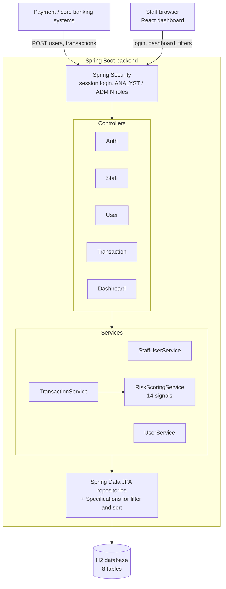
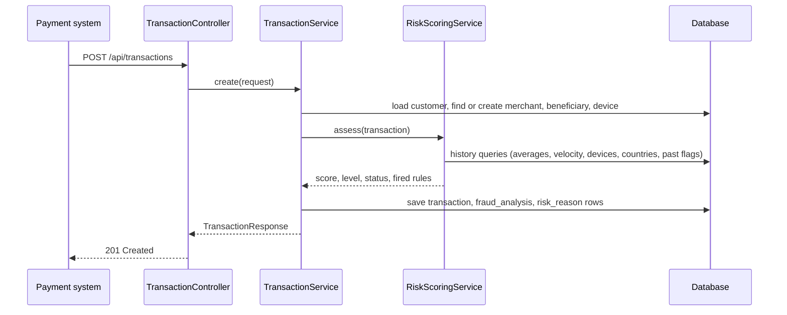
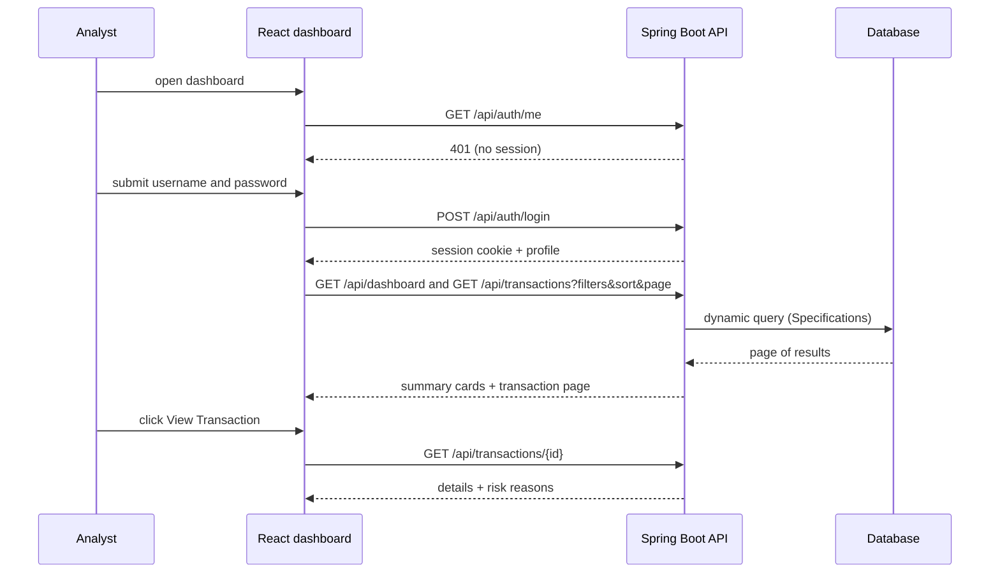
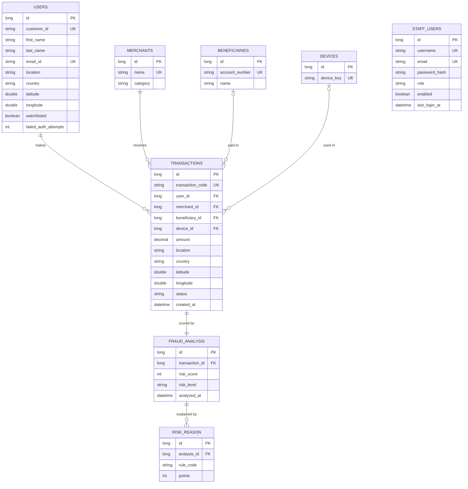

# Fraud Monitoring System

A mini fraud-detection platform for banking transactions. Every incoming transaction is scored by a rule-based risk engine, assigned a risk level and a decision (approved, review or blocked), and shown to fraud analysts on a secured dashboard with filtering, sorting and per-transaction explanations.

- **Backend:** Java 21, Spring Boot 4.1, Spring Data JPA, Spring Security, H2, Lombok
- **Frontend:** React (Vite)
- **Auth:** session-cookie login for staff, role-based access (`ANALYST`, `ADMIN`)

---

## Features

- **Rule-based risk scoring** with 14 independent signals (amount anomaly, velocity, new device, impossible travel, watchlist and more)
- **Four risk levels:** `LOW`, `MEDIUM`, `HIGH`, `CRITICAL`, each mapped to a decision
- **Explainable results:** every fired rule is stored with its points, so analysts see why a transaction scored the way it did
- **Normalized data model:** customers, merchants, beneficiaries, devices, transactions and fraud analysis are separate tables
- **Staff-only dashboard** with login, admin-managed accounts and no public sign-up
- **Filtering** on customer, merchant, beneficiary, country, risk level, status, amount range, score range and date range, with multi-select
- **Sorting** (ascending or descending) on date, amount, risk, status, customer and merchant, plus pagination
- **Live dashboard** with summary cards that refresh every 10 seconds

---

## System architecture



### Workflow: scoring a new transaction



### Workflow: analyst reviewing the dashboard



---

## Project structure

```
com.example.demo
├── config/       SecurityConfig, AdminBootstrap
├── security/     StaffUserDetailsService
├── model/        User, StaffUser, Merchant, Beneficiary, Device, Transaction,
│                 FraudAnalysis, RiskReason, Role, RiskLevel, RiskRule, TransactionStatus
├── dto/          requests, responses, TransactionFilter, PageResponse
├── repository/   JPA repositories + FraudAnalysisSpecs (dynamic filter and sort)
├── service/      UserService, StaffUserService, TransactionService, RiskScoringService
└── controller/   AuthController, StaffController, UserController,
                  TransactionController, DashboardController

frontend/src
├── api.js            fetch wrapper (sends cookies, handles 401)
├── AuthContext.jsx   login state
├── Login.jsx
├── Dashboard.jsx     cards, filters, sortable table, pagination, detail modal
├── StaffAdmin.jsx    admin-only staff registration
├── App.jsx
└── App.css
```

---

## Data model

The original single `Transaction` table was split so each table holds one kind of fact. Clean transactions simply have zero `risk_reason` rows, so there are no null "reason" columns.



`users` holds the bank's **customers** (the subjects of monitoring). `staff_users` holds the **dashboard operators**. They are deliberately separate: customers never log in here.

---

## Risk scoring

Each signal is a separate method in `RiskScoringService` that returns points. The points are added up and capped at 100. Every fired rule is saved as a `risk_reason` row.

| Rule | Condition | Points |
|---|---|---:|
| `AMOUNT_ANOMALY` | More than 10x the customer's normal amount | 30 |
| | More than 5x normal (or first transaction of ₹1L or more) | 20 |
| `VELOCITY` | More than 10 transactions in 10 minutes | 25 |
| | More than 5 transactions in 10 minutes | 15 |
| `NEW_BENEFICIARY` | First transfer to this beneficiary | 10 |
| `NEW_COUNTRY` | Not the home country and not seen before | 15 |
| `FAR_FROM_HOME` | More than 500 km from the customer's home location | 10 |
| `IMPOSSIBLE_TRAVEL` | Distance from last transaction exceeds 900 km/h travel speed | 25 |
| `NEW_DEVICE` | Device never used by this customer | 15 |
| `FAILED_AUTH` | 3 or more failed authentication attempts on the account | 15 |
| `PRIOR_FLAGS` | 3 or more previous HIGH/CRITICAL transactions | 20 |
| | 1 to 2 previous HIGH/CRITICAL transactions | 10 |
| `HIGH_RISK_MERCHANT` | Crypto, gambling, wire transfer, money exchange | 15 |
| `HIGH_RISK_GEOGRAPHY` | Configured high-risk country | 15 |
| `ROUND_NUMBER` | Amount of ₹50,000 or more that is a multiple of ₹10,000 | 5 |
| `WATCHLIST` | Customer is on the watchlist | 25 |
| `WEEKEND_SPIKE` | Weekend transaction above 2x the normal amount | 5 |

"New" signals (beneficiary, device) only apply once a customer has history, so a customer's very first transaction is not flagged for being new.

| Score | Risk level | Decision |
|---|---|---|
| 0 to 24 | `LOW` | `APPROVED` |
| 25 to 49 | `MEDIUM` | `APPROVED` |
| 50 to 74 | `HIGH` | `REVIEW` |
| 75 to 100 | `CRITICAL` | `BLOCKED` |

The "normal amount" is the average of the customer's previously approved transactions, so earlier fraud does not inflate their baseline.

---

## API reference

All `/api/**` endpoints except login require a session cookie. `/api/admin/**` requires the `ADMIN` role.

| Method | Endpoint | Role | Purpose |
|---|---|---|---|
| POST | `/api/auth/login` | public | Log in, returns profile and sets session cookie |
| GET | `/api/auth/me` | any staff | Current session, used by the frontend on page load |
| POST | `/api/auth/logout` | any staff | End the session |
| POST | `/api/admin/staff` | ADMIN | Register a staff account |
| GET | `/api/admin/staff` | ADMIN | List staff accounts |
| PATCH | `/api/admin/staff/{id}/enabled?value=true\|false` | ADMIN | Enable or disable an account |
| POST | `/api/users` | staff | Create a customer |
| GET | `/api/users` | staff | List customers |
| GET | `/api/users/{customerId}` | staff | Get one customer |
| POST | `/api/transactions` | staff | Submit a transaction (scored immediately) |
| GET | `/api/transactions` | staff | Filtered, sorted, paginated list |
| GET | `/api/transactions/risky` | staff | HIGH and CRITICAL transactions |
| GET | `/api/transactions/{id}` | staff | Transaction detail with risk reasons |
| GET | `/api/dashboard` | staff | Summary card figures |

### Filtering, sorting and pagination

`GET /api/transactions` combines all filters with **AND**. Multiple values inside one filter are **OR**'d (comma-separated).

| Parameter | Matching |
|---|---|
| `customerId` | exact, case-insensitive, any of |
| `merchant` | name contains, any of |
| `beneficiary` | name or account number contains, any of |
| `country` | exact, any of |
| `riskLevel` | `LOW,MEDIUM,HIGH,CRITICAL` |
| `status` | `APPROVED,REVIEW,BLOCKED` |
| `minAmount`, `maxAmount` | inclusive range |
| `minScore`, `maxScore` | risk score range |
| `from`, `to` | `yyyy-MM-dd`, `to` is inclusive |

| Parameter | Values |
|---|---|
| `sortBy` | `date` (default), `amount`, `risk`, `status`, `customer`, `merchant` |
| `sortDir` | `asc`, `desc` (default) |
| `page`, `size` | zero-based page, size capped at 100 |

Sorting by `risk` uses the score, which keeps levels in the correct order. Sorting by `status` ranks by severity (approved, review, blocked) rather than alphabetically.

```bash
curl -b cookies.txt "localhost:8080/api/transactions?riskLevel=HIGH,CRITICAL&status=REVIEW,BLOCKED&minAmount=100000&merchant=gold&sortBy=amount&sortDir=desc&size=10"
```

---

## Security

- Staff sign in with username and password. Passwords are stored as **BCrypt** hashes.
- There is **no public registration**. Admins create accounts via `POST /api/admin/staff`.
- The first admin is created at startup from `app.admin.*` properties, only when `staff_users` is empty.
- Login errors are identical for a wrong user, wrong password and disabled account.
- Sessions use an HTTP-only, `SameSite=Strict` cookie with a 30 minute timeout, and the session id is rotated on login.
- Roles: `ANALYST` (view and filter) and `ADMIN` (everything plus staff management).

---

## Getting started

### Prerequisites

- JDK 21
- Maven
- Node.js 18+

### Backend

Add the validation starter to `pom.xml` if it is not there yet:

```xml
<dependency>
    <groupId>org.springframework.boot</groupId>
    <artifactId>spring-boot-starter-validation</artifactId>
</dependency>
```

`src/main/resources/application.properties`:

```properties
spring.datasource.url=jdbc:h2:mem:frauddb
spring.datasource.username=sa
spring.datasource.password=
spring.jpa.hibernate.ddl-auto=update
spring.h2.console.enabled=true

server.error.include-message=always
server.servlet.session.timeout=30m
server.servlet.session.cookie.http-only=true
server.servlet.session.cookie.same-site=strict
spring.jpa.properties.hibernate.default_batch_fetch_size=50

app.admin.username=admin
app.admin.email=admin@example.com
app.admin.password=${ADMIN_PASSWORD:ChangeMe@12345}
```

Run it:

```bash
mvn spring-boot:run
```

The API starts on `http://localhost:8080`. The H2 console is at `/h2-console` (JDBC URL `jdbc:h2:mem:frauddb`, user `sa`, empty password).

### Frontend

```bash
npm create vite@latest fraud-dashboard -- --template react
cd fraud-dashboard
# copy the files from frontend/src
npm install
npm run dev
```

Open `http://localhost:5173` and sign in as `admin` with the password from `app.admin.password`.

### Sample data

H2 is in-memory, so data is lost on every restart. To load sample customers, merchants and transactions automatically, put the seed `INSERT` script in `src/main/resources/data.sql` and add:

```properties
spring.jpa.defer-datasource-initialization=true
spring.sql.init.mode=always
```

### Quick test

```bash
# log in
curl -c cookies.txt -X POST localhost:8080/api/auth/login -H "Content-Type: application/json" \
  -d '{"username":"admin","password":"ChangeMe@12345"}'

# create a customer
curl -b cookies.txt -X POST localhost:8080/api/users -H "Content-Type: application/json" \
  -d '{"customerId":"C7789","firstName":"Vikram","lastName":"Rao","emailId":"vikram@example.com","location":"Hyderabad","country":"India","latitude":17.38,"longitude":78.48,"failedAuthAttempts":4}'

# submit a transaction
curl -b cookies.txt -X POST localhost:8080/api/transactions -H "Content-Type: application/json" \
  -d '{"customerId":"C7789","amount":200000,"location":"Online","country":"Iran","merchantName":"QuickWire","merchantCategory":"Wire Transfer","deviceKey":"D-99","beneficiaryAccount":"BN-7","beneficiaryName":"Test Payee"}'
```

---

## Known limitations

- **In-memory database:** data resets on restart. Switch to PostgreSQL or MySQL for persistence.
- **Constants in code:** high-risk categories and countries are hard-coded in `RiskScoringService`.
- **CSRF is disabled** for local development. Before production, serve the app from one domain and re-enable CSRF with `CookieCsrfTokenRepository`.
- **Ingest endpoints** (`POST /api/users`, `POST /api/transactions`) currently use staff login. Give the payment systems their own API key or service credential.
- **Dashboard cards** show overall totals and do not follow the table filters.
- **Failed auth counter** must be maintained by the real login flow of the banking app (increment on failure, reset on success).
- The H2 console is open in the security config for development only. Remove it in production.

## Roadmap

1. **Review workflow:** approve or block `REVIEW` items with a note, recorded against the staff user, for a full audit trail.
2. **`Account` entity** between customers and transactions (multiple accounts and cards per customer).
3. **Config tables** for high-risk categories, countries and watchlist entries, with a reason and date per entry.
4. **Rule configuration table** with tunable points and a rule version on each analysis.
5. **`AuthEvent` table** to support time-windowed failed-login rules.
6. **Login hardening:** account lockout, rate limiting and an audit log.
7. **More signals** from the AML feature list: cash ratios, cross-border counts, tenure, hawala and VIP flags.
8. **Rename `User` to `Customer`** to avoid confusion with `StaffUser`.